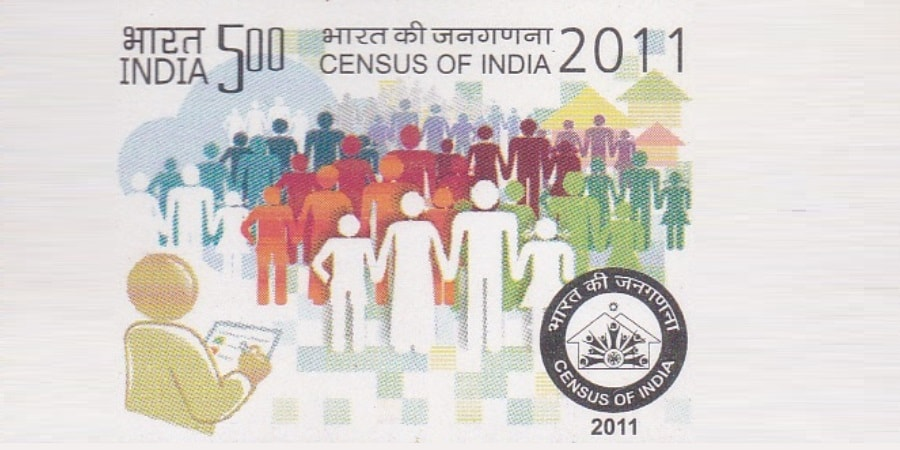

# India Census Analysis




Analysis of India census 2011 using only SQL.

Yes, Yes, I know previously I said to use R for data cleaning or analysis but you see SQL IS SQL. So, what's the problem to learn this also.

The analysis shown though SQL queries and any analysis that can be shown through SQL queries can also be fetched from visualization tools like Tableau and PowerBI even with more ease. But as said, SQL IS SQL.

But SQL seems to be well suited to get data insights which helps to make decision about what steps should we take to do data cleaning and there is no doubt that it sometimes get a bit complex when it comes to data cleaning or working with subqueries.

## Download

```bash
  git clone https://github.com/adionmission/India-Census-2011-Analysis.git
```

## About Dataset

The dataset is of India Census provided by the acknowledgement but it has some issues that are:

 - Number were in character form in the given dataset.

 - Presence of #N/A value in state column in Dataset2.csv.

Some analysis were also provided by the acknowledgement without data cleaning which now seems to be wrong. NO OFFENCE.

In my repository, it has been corrected.

The Dataset1 has been renamed as Census_1 and Dataset2 has been renamed as Census_2. Census_1 and Census_2 are table name not csv file name.

## Analysis through SQL

Steps taken for data analysis through SQL:

 - Converting xlsx into csv.
 - Importing csv as table.
 - Finding any duplicate or NA values.
 - Removing #N/A value from State column in dataset_2.
 - Getting the total, average and median population.
 - Median growth.
 - Median literacy.
 - Median sex ratio.
 - Combining Census_1 and Census_2 and getting states name with literacy above average.
 - Getting district and states name with literacy above 95%.
 - Getting district and states name with literacy below 25%.
 - Getting top 5 most populus states.
 - Getting top 5 growth%.
 - Top 5 Population vs Area.

<b>*Note:</b> The above questions are all made up questions by me. 

Median was given more preference as compared to average because median can give you more accurate information.

**Example:** Suppose you are planning to buy a house and wants to get an idea of how much budget should I plan. So, lets assume there are 10 house in which 2 houses cost $800,000 and other 9 houses cost $200,000. If you take average of this to get a budget idea, you get $320,000. Do you really think you should have this budget? Now take median of this, you get $200,000. The exact budget you need to have. So, you see how median can be better than average.

Now after reading this please don't think that, "what about brokerage or furniture cost?". Bro, I am just giving an example to prove how median is better than average.

## Acknowledgement

- [Dataset](https://github.com/ashutoshkr103/SQL-portfolio-project-files-and-codes)
